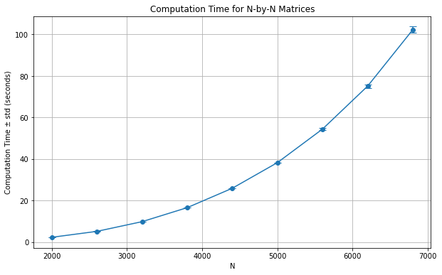

# MPI Experiment

Данный отчёт сгенерирован на основе [файла Python Notebook](experiment.ipynb).

## Постановка задачи

Написать программу вычисления матричного выражения:

$\mathbf{A} = \mathbf{B}\ \mathbf{C}^2 + M(\mathbf{C})\ \mathbf{I} + \mathbf{I} + D(\mathbf{B})\ \mathbf{E}$,

где $\mathbf{B}$, $\mathbf{C}$ – квадратные плотные матрицы, элементы которых имеют тип double, причем элементы матрицы $\mathbf{C}$ задаются с помощью генератора псевдослучайных чисел, $\mathbf{I}$ – единичная матрица, $\mathbf{E}$ – полностью заполненная матрица, все элементы которой равны единице, $M(\mathbf{C)}$ – среднее значений элементов матрицы $\mathbf{C}$, $D(\mathbf{C)}$ – дисперсия элементов матрицы $\mathbf{C}$. Распараллелить эту программу с помощью MPI (Message Passing Interface). Исследовать зависимость масштабируемости параллельной версии программы от ее вычислительной трудоемкости (размера матриц).  
Проверить корректность параллельной версии.  
Проверка закона Амдала. Построить зависимость ускорение:число процессов для заданного примера.

## Программно-аппаратная конфигурация тестового стенда

Информация о программно-аппаратной конфигурации тестового стенда была получена c помощью следующего shell-скрипта:

```sh
echo -n "OS: "; cat /etc/os-release | grep PRETTY_NAME \
     | cut -d= -f2 | tr -d '"'
echo -n "GCC Version: "; gcc --version | head -n 1
echo -n "CPU Model: "; lscpu | grep "Model name" \
     | awk -F: '{print $2}' | xargs
echo -n "Logical Cores: "; lscpu | grep "^CPU(s):" \
     | awk -F: '{print $2}' | xargs
echo -n "RAM: "; free -h --si | awk '/Mem:/ {print $2}'
```

Результат работы скрипта получения программно-аппаратной конфигурации:

    OS: Ubuntu 22.04.4 LTS
    MPICC Version: gcc (Ubuntu 11.4.0-1ubuntu1~22.04) 11.4.0
    CPU Model: 13th Gen Intel(R) Core(TM) i7-13700H
    Logical Cores: 20
    Physical Cores: 14
    RAM: 31G


Также стоит отметить, что среди ядер процессора i7-13700H можно выделить шесть производительных и восемь эффективных. 

## Метод

Алгоритм решения:

- вычисление $m = M(\mathbf{C})$;
- вычисление $d = D(\mathbf{B})$;
- вычисление $\mathbf{BC} = \mathbf{B}\ \mathbf{C}$;
- вычисление $\mathbf{BCC} = \mathbf{BC}\ \mathbf{C}$;
- прибавление $1 + m$ к каждому элементу главной диагонали $\mathbf{BCC}$;
- прибавление $d$ к каждому элементу полученной на предыдущем шаге матрицы.

Для вычисления произведения матриц используется наивный алгоритм, основанный на определении произведения матриц $(\mathbf{A}\ \mathbf{B})_{i,j} = \sum_{k=1}^n \mathbf{A}_{i,k}\ \mathbf{B}^T_{j,k}$. Правый множитель транспонируется перед вычислением произведения, чтобы эффективнее использовать кэши процессора.

## Реализация

Решение реализовано на языке программирования C. Командой `make` можно собрать следующие исполняемые файлы:

- `main` – решает поставленную задачу;
- `save_random_matrix` – генерирует псевдослучайные квадратные матрицы указанного размера.

Для распараллеливания умножений матриц используется MPI:

- строки матрицы $\mathbf{B}$ поровну распределяются между процессами, то есть $k$-ый процесс получает матрицу $\mathbf{B}_k$, содержащую строки матрицы $\mathbf{B}$, соответствующие интервалу, выделенному $k$-му процессу;
- каждый процесс вычисляет матрицу $\mathbf{BCC}_k = (\mathbf{B}_k\ \mathbf{C})\ \mathbf{C}$, содержащую строки матрицы $\mathbf{BCC}$, соответствующие интервалу, выделенному $k$-му процессу;
- процессы передают матрицы $\mathbf{BCC}_k$ процессу с рангом $0$, который собирает из матриц $\mathbf{BCC}_k$ матрицу $\mathbf{BCC}$.

## Эксперимент

В данном разделе приведены результаты экспериментов, призванных ответить на три исследовательских вопроса:

1. Корректно ли разработанная реализация работает в параллельном режиме?
2. Как разработанная реализация масштабируется при увеличении размера матриц?
3. Выполняется ли для разработанной реализации закон Амдала?

### Корректность

Сначала была проверена корректность работы последовательной версии программы на следующих небольших матрицах $\mathbf{B}$ и $\mathbf{C}$ размера $2 \times 2$, правильный ответ для которых был посчитан вручную:

$$
\mathbf{B} = \begin{bmatrix} 1 & 2 \\ 3 & 4 \end{bmatrix}, \quad
\mathbf{C} = \begin{bmatrix} 5 & 6 \\ 7 & 8 \end{bmatrix},
$$
$$
M(\mathbf{C}) = 6.5, \quad D(\mathbf{B}) = 1.25,
$$
$$
\mathbf{A} = \mathbf{B} \cdot \mathbf{C}^2 + M(\mathbf{C}) \cdot \mathbf{I} + \mathbf{I} + D(\mathbf{B}) \cdot \mathbf{E},
$$
$$
\mathbf{A} = \begin{bmatrix} 257.75 & 291.25 \\ 566.25 & 666.75 \end{bmatrix}.
$$


Для проверки соответствия результатов работы последовательной версии программы результатам, полученным вручную, использовался следующий Python-скрипт:

```python
subprocess.run(
    [
        './main',
        'data/B_sample.txt',
        'data/C_sample.txt',
        'data/A_sample_actual.txt',
    ],
    stdout=subprocess.PIPE, text=True, check=True
)
actual_path = "data/A_sample_actual.txt"
expected_path = "data/A_sample_expected.txt"

print(f"'{actual_path}' file content:")
!cat {actual_path} 

if (filecmp.cmp(actual_path, expected_path)):
    print("Seqential version results match manual results")
else:
    print("Seqential and manual results diverged!")
```

Далее приведён результат работы скрипта проверки корректности последовательной версии программы на рассмотренном примере:

    'data/A_sample_actual.txt' file content:
    2
    257.750000 291.250000 
    566.250000 666.750000 
    Seqential version results match manual results


После этого был запущен следующий Python-скрипт, генерирующий псевдослучайные матрицы размера $3000 \times 3000$ и сверяющий для этих матриц результаты работы последовательной и параллельной версий программы.

```python
_, _, seq_output = run_experiment(matrix_size=3000, num_procs=1)
_, _, par_output = run_experiment(matrix_size=3000, num_procs=12)
if (filecmp.cmp(seq_output, par_output)):
    print("Parallel and sequential results match")
else:
    print("Parallel and sequential results diverge!")
```

Далее приведён результат работы данного скрипта:

    Parallel and sequential results match


### Масштабируемость

Здесь и далее время работы указывается без учёта времени генерации входных данных и времени, затраченного на операции ввода-вывода, но с учётом времени, затраченного на коммуникацию между процессами.

Для оценки масштабируемости программы от её вычислительной трудоемкости (размера матриц) был выполнен следующий Python-скрипт:
```python
sizes = list(range(2000, 7000, 600))
num_procs = 6

mean_times_for_sizes = []
stds_for_sizes = []
for size in sizes:
    mean_time, time_std, _ = run_experiment(size, num_procs)
    mean_times_for_sizes.append(mean_time)
    stds_for_sizes.append(time_std)

mean_time_plus_minus_std = [
    f"{mean:.2f} ± {std:.2f}" 
    for mean, std in zip(mean_times_for_sizes, stds_for_sizes)
]

pd.DataFrame({
    'N': sizes,
    'Time ± std (seconds)': mean_time_plus_minus_std
}).round(2)
```

В результате работы скрипта была построена следующая таблица, показывающая как время работы параллельной версии программы для матриц размера $N \times N$ увеличивается с ростом $N$ при использовании 6 процессов (после <<$\pm$>> указывается выборочное стандартное отклонение по результатам пяти замеров):


|    N | Time ± std (seconds)   |
|-----:|:-----------------------|
| 2000 | 2.38 ± 0.01            |
| 2600 | 5.24 ± 0.03            |
| 3200 | 9.90 ± 0.03            |
| 3800 | 16.63 ± 0.06           |
| 4400 | 25.98 ± 0.07           |
| 5000 | 38.32 ± 0.02           |
| 5600 | 54.47 ± 0.46           |
| 6200 | 75.16 ± 0.88           |
| 6800 | 102.28 ± 1.49          |


Также по данной таблице был построен следующий график, более наглядно показывающий связь размера матрицы $N$ и времени работы:



    


С помощью следующего Python-скрипта был определён коэффициент наклона прямой, отражающей зависимость времени работы программы от размера задачи в логарифмическом масштабе.

```python
slope, _ = np.polyfit(np.log(sizes), np.log(mean_times_for_sizes), deg=1)
print(f"Slope on a log-log plot: {slope:.2f}")
```

В результате выполнения скрипта была получена следующая оценка угла наклона, соответствующая степени экспоненты в зависимости времени выполнения от размера задачи:

    Slope on a log-log plot: 3.06


### Проверка закона Амдала

Для оценки зависимости времени работы от числа процессов и проверки закона Амдала был выполнен следующий Python-скрипт:

```python
matrix_size = 3000
max_procs = 14

procs_list = list(range(1, max_procs+1))
times_for_procs = []

for num_procs in procs_list:
    time, _, _ = run_experiment(matrix_size, num_procs)
    times_for_procs.append(time)

base_time = times_for_procs[0]
speedups = [base_time / t for t in times_for_procs]

def amdahl_law(N, P):
    return 1 / ((1 - P) + P / N)

params, _ = curve_fit(amdahl_law, procs_list[:6], speedups[:6], bounds=(0, 1))
parallel_part = params[0]

predicted_speedups = [amdahl_law(N, parallel_part) for N in procs_list]

pd.DataFrame({
    'Number of Processes': procs_list,
    'Measured Speedup': speedups,
    f"Amdahl's law (P={parallel_part:.4f})": predicted_speedups
}).round(2)
```

В следующее таблицы приведены средние ускорения по результатам пяти замеров для матриц размера $3000 \times 3000$. Также в таблице для каждого рассмотренного числа процессов указано ускорение, предсказываемое законом Амдала для значения параметра $P$, минимизирующего среднеквадратичную ошибку законом Амдала для тех случаев, когда число процессов не больше числа производительных ядер процессора.


|   Number of Processes |   Measured Speedup |   Amdahl's law (P=0.9182) |
|----------------------:|-------------------:|--------------------------:|
|                     1 |               1    |                      1    |
|                     2 |               1.95 |                      1.85 |
|                     3 |               2.8  |                      2.58 |
|                     4 |               3.22 |                      3.21 |
|                     5 |               3.73 |                      3.77 |
|                     6 |               4.2  |                      4.26 |
|                     7 |               3.02 |                      4.7  |
|                     8 |               3.29 |                      5.09 |
|                     9 |               3.18 |                      5.44 |
|                    10 |               3.47 |                      5.76 |
|                    11 |               3.49 |                      6.05 |
|                    12 |               3.62 |                      6.32 |
|                    13 |               3.83 |                      6.56 |
|                    14 |               3.9  |                      6.79 |


    

    


## Выводы

Эмпирическим путём установлено, что:

- параллельная реализация работает корректно на рассмотренном примере;
- время работы параллельной реализации при увеличении размера матрицы $N \times N$ растёт примерно пропорционально $N^{3.06}$;
- закон Амдала выполняется для $P=0.92$, когда число процессов меньше либо равно 6.

Объяснение расхождений с теорией:

- расхождение с теоретической оценкой сложности $\mathcal{O}(N^3)$ объясняется конечностью размера кэшей-процессора: с ростом размера матрицы всё меньшая часть матрицы помещается в кэши, что приводит к замедлению реализации;
- невыполнение закона Амдала при использовании более чем 6 процессов объяснятся тем, что, начиная с 7 процессов, начинают использоваться не только производительные, но и эффективные ядра процессора i7-13700H, что плохо сочетается с равномерным распределением строк матрицы $\mathbf{B}$ между процессами;
- наблюдаемая на практике доля параллельных вычислений $P=0.92$ существенно меньше $1$, так как процессы конкурируют за общий L3-кэш и общие модули ОЗУ.
